### Version 1.2 updated

 

 <a href="https://github.com/Usagib/booking-portfolio">
   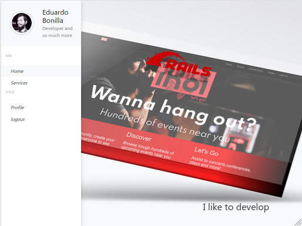

 </a>

 <h3 align="center">Booking App bootstrapped with React + Redux with RESTful API developed in Ruby on Rails</h3>

 

  Portfolio application with user dashboard for requesting services and create appointments
    
 

## Table of Contents

* [Version Notes](#version-notes)
* [About the Project](#about-the-project)
* [Live Demo](#live-demo)
* [How to run](#how-to-run)
* [Features](#features)
* [API Endpopints and Validations](#api-endpopints-and-validations)
* [Screenshots](#screenshots)
* [Built With](#built-with)
* [Contact](#contact)

## Version Notes
### VERSION 1.1 Update
Booking portfolio got a radical makeover: check out the new smooth UX

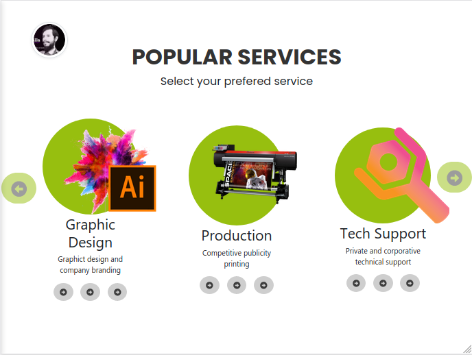
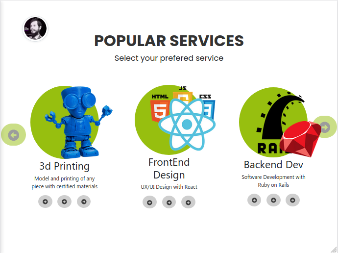
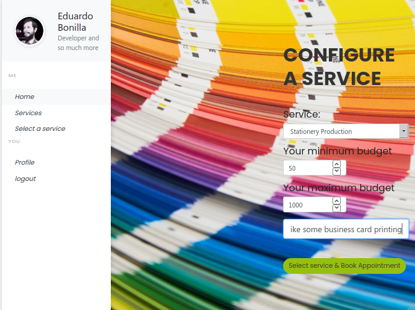

## About The Project

RESTful API developed using Ruby on Rails, Json Web Token, bcrypt to ensure log security and deployed to Heroku, Frontend built with React + Redux and bootstrap.

## Live Demo

* [booking-portfolio](https://usagi-booking.surge.sh/)
* [booking-api](https://usagi-booking-api.herokuapp.com/)

- Sample User email: test1@test.com password: password

### How to run

You can acess the live demo or:

* Run it Locally

Backend Api
- Fork or clone this repository
- run > bundle install
- run > rails server -p 3001

Frontend
- run cd client/
- run > npm install
- run > npm start
- access your localHost:3000 on your browser

### Features

* User can create a new profile trough api Call
* User can log into the app trough api call
* User can request new services
* User can book appointments for their services
* User can navigate their data trough the profile dashboard
* Straightforward UI

## API Endpopints and Validations
- URL: https://usagi-booking-api.herokuapp.com/

* Endpoints
### Authentication
Login:
- POST /api/auth/login(.:format)
* params: email:string, password:string
- POST /api/signup(.:format)
* params: name:string, company:string, email:string, password:string, password_confirmation:string
Response: auth_token

Headers: Authorization: auth_token

Services
* params: name:string, description:string, min_cost:integer. max_cost:integer
- GET /api/services(.:format)
- POST /api/services(.:format)
- GET /api/services/:id(.:format)
- PATCH /api/services/:id(.:format)
- PUT /api/services/:id(.:format)
- DELETE /api/services/:id(.:format)

Appointments
* params: date:date, time:time, description:text, name:string
- GET /api/services/:service_id/appointments(.:format)
- POST /api/services/:service_id/appointments(.:format)
- GET /api/services/:service_id/appointments/:id(.:format)
- PATCH /api/services/:service_id/appointments/:id(.:format)
- PUT /api/services/:service_id/appointments/:id(.:format)
- DELETE /api/services/:service_id/appointments/:id(.:format)

### Screenshots

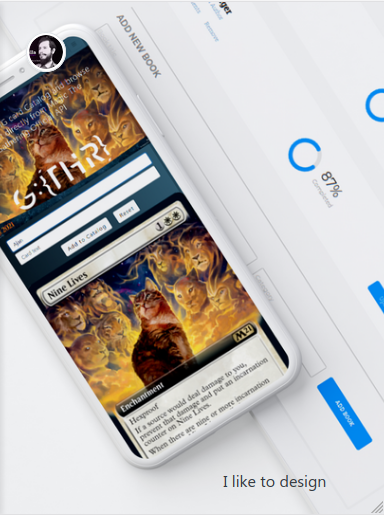
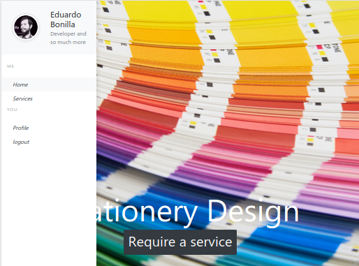
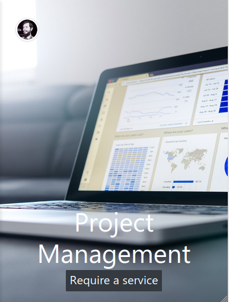
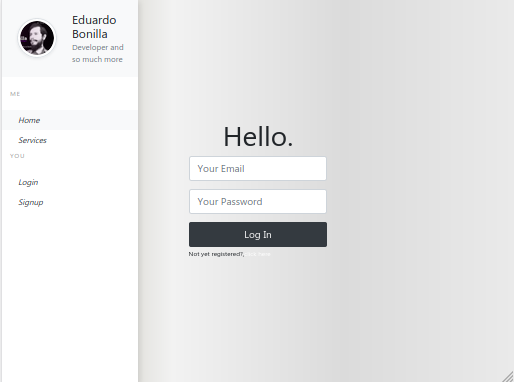
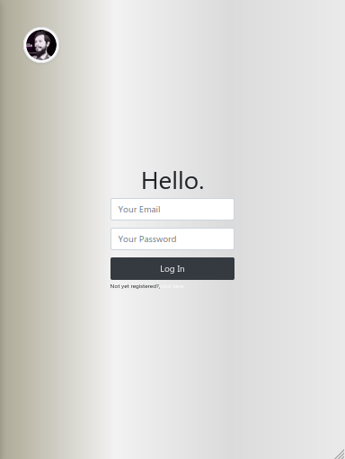
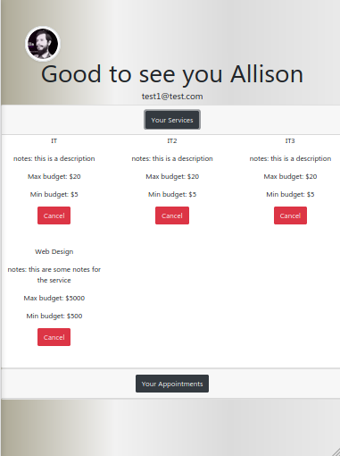
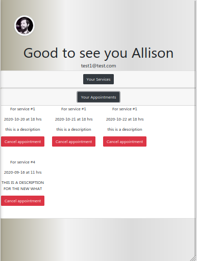
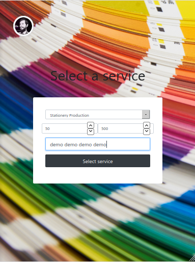
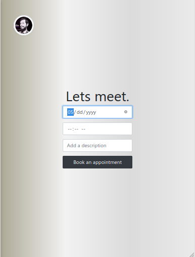

## Built With

* HTML5
* CSS3
* JavaScript ES6
* React
* Redux
* Bootstrap
* Ruby
* Ruby on Rails
* postgresql

Deployed with:

* Heroku
* Surge

Additional packages used
* npm axios
* npm react
* npm react-router-dom
* npm qs
* npm react-bootstrap
* npm prop-types
* gem bcrypt
* gem jwt
* gem rspec-rails
* gem dtaabase_cleaner
* gem shoulda-matchers
* gem faker

## Contact

* Eduardo Bonilla Cáceres - eduardobonillac@gmail.com
* [My Portfolio](https://usagib.surge.sh)
* [My Twitter](https://twitter.com/UsagiBonilla)

## Show your support

Give a ⭐️ if you like this project!
